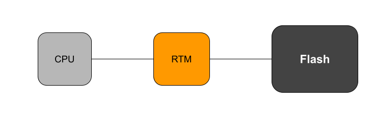

# Firmware Measurement Descriptor

The Firmware Measurement Descriptor (FMD) is a file header which provides
metadata about how the image should be measured (such as by a hardware
Root of Trust) during boot.

## Terms

* RTM: Root of Trust for Measurement
* Verifier: An entitiy which verifies measurements taken by an RTM
* TPM: Trusted Platform Module
* TLV: Type-Length-Value

## Measured Boot

In distributed systems, a common desire is to ensure a machine is in a
verifiably good state before allowing it to handle potentially sensitive
information. One way to solve this problem is through measured boot.

During boot, each piece of code, from system firmware to OS components, will
measure (take a hash of) the next component before transferring control. After
boot is complete, these measurements can be used to prove to a Verifier that what
code was booted on the system.

Take for example a standard UEFI Linux system which stores measurements in a
TPM:

1. UEFI hashes bootloader and extends hash into TPM, then executes bootloader
1. Bootloader hashes Linux kernel and extends hash into TPM, then executes Linux
1. After boot, userspace software can query TPM to get a Quote of the boot
   measurements

### Active RTM and Descriptor Motivation

One limitation of the above is that the BIOS image is not measured and cannot be
attested to. An possilbe alternative measured boot implementation could see the bios
image measured from flash by a hardware Root of Trust which measures the image
in flash before it is booted.

In order to support an active RTM which can measure the contents of flash
before boot, the RTM should be instructed to measure specific regions of
flash which contain the static BIOS image which is to be booted. The
following sections will describe such a mechanism.

## Descriptor Format

Given the structures defined in `inc/payload_descriptor.h`, a payload
descriptor would be as follows:

```
---------------------------------- Layout ----------------------------------
|                 struct payload_descriptor_header                         |
----------------------------------------------------------------------------
|                     struct payload_region_info                           |
----------------------------------------------------------------------------
|         struct payload_region[payload_region_info.region_count]          |
----------------------------------------------------------------------------
```

### TLV Structures

Each structure in the descriptor carries a header which includes tag, length
and version information.

The TLV structure allows the descriptor to be extended without breaking old
parsing. A structure with an unknown tag can be safely ignored by parsing logic
by simply reading the length and skipping the section of the descriptor
entirely.

### Structure Versioning

Every structure in the descriptor has a version field as part of the TLV header.
This allows is to support adding/removing fields in the future. If a structure
adds/removes/changes the size of a field, the version of that structure should
be incremented. This allows a parser to use different pasrsing logic for
different versions of a structure.

### Integrity Rationale

The FMD structure does not carry a signature or any other integrity protection
mechanism. This is because the goal of the FMD is to tell the RTM what to
measure during boot to allow the verifier to make a trust determination
about what was booted.

If the measurement reported by the RTM after boot matches the Verifier's
expectation this necessarily implies:

1. The FMD in flash matches the FMD the Verifier expected
1. The contents of the specified regions matches what the Verifier expected

Any change to the FMD or to the contents of the measured regions will be
reflected in the measurement.

### Measuring regions

Measuring the regions specified in the FMD descriptor entails computing a
hash over all regions in the order they appear in the descriptor. The hash
should be computed using the function specified by
`image_descriptor.region_info.hash_type`.

Since the CPU boots from a specific location (the reset vector), the location
in flash of the measured data is also important. Two regions with the same
content but at different locations in flash should not have the same
measurement. To achieve this, the measurement of a region `a` should be:

```
hash(a.region_offset ||
     a.region_size ||
     flash_contents(a.region_offset, a.region_offset + a.region_size))
```

## Example Boot Process

The FMD descriptor is intended to be consumed by an RTM during boot. One example
of such a boot process would be an RTM which interposes on flash and measures
code before it is run by the CPU.



An example boot could be the following:
1. RTM powers on.
1. RTM holds CPU in reset.
1. RTM locates FMD descriptor in flash and parses it.
1. RTM hashes the regions listed in the FMD descriptor and stores the
   resulting measurement.
1. RTM brings CPU out of reset.
1. CPU begins booting from flash, unimpeded by the RTM.

## Reference Library

In addition to the descriptor format, a reference library is also provided for
creating and parsing the descriptor.

Source for the library can be found in the [lib](lib/) directory. Public
headers are in [inc/fmd](inc/fmd/).

### Samples

The [samples directory](samples/) contains example code which uses the
reference library to do common FMD-related tasks.

* **create\_parse**: Generate, serialize, and parse an FMD descriptor
